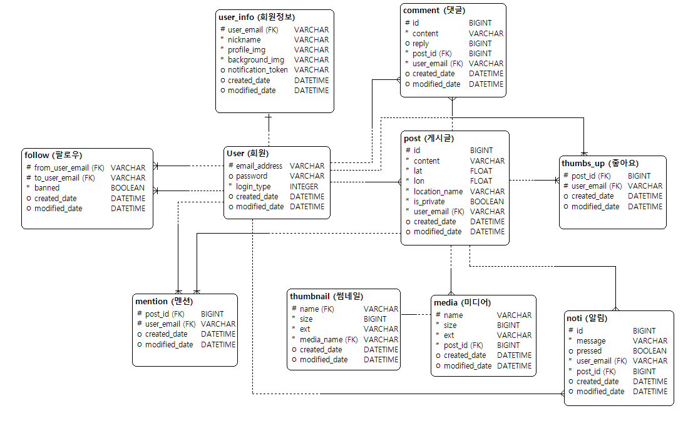
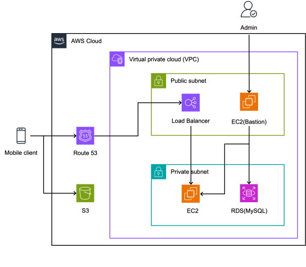

## PIN

### 위치기반 SNS - PIN


### 기능 목록

+ 이메일 인증
+ 회원가입
+ 소셜 로그인
+ JWT 토큰인증
+ 미디어 파일(이미지, 동영상) 업로드, 조회 및 재생
+ 게시글, 댓글
+ 사용자 검색
+ 팔로우
+ 지도상에서 자신 및 팔로우하고 있는 계정의 게시글 표시
+ 푸시 알림

### 개발환경

- react-native 0.71.7
- spring-boot 2.7.7
- ubuntu 20.04.6 LTS
- nginx 1.18.0
- mysql 8.0.36

### 프로젝트 구조

```
├── PinApiApplication.java
├── core
│   ├── email
│   │   ├── EmailController.kt
│   │   ├── dto
│   │   ├── entity
│   │   ├── exception
│   │   ├── repository
│   │   └── service
│   ├── notification
│   │   ├── config
│   │   └── service
│   ├── post
│   │   ├── PostController.kt
│   │   ├── config
│   │   ├── dto
│   │   ├── entity
│   │   ├── exception
│   │   ├── repository
│   │   └── service
│   ├── security
│   │   ├── CORSConfig.kt
│   │   ├── SecurityConfig.kt
│   │   ├── filter
│   │   └── util
│   └── user
│       ├── UserController.kt
│       ├── constants
│       ├── dto
│       ├── entity
│       ├── exception
│       ├── repository
│       └── service
├── swagger
│   ├── SwaggerConfig.kt
│   └── SwaggerRedirector.kt
└── util
    ├── FileUtil.kt
    └── LogUtil.kt

```

### EXCEPTION LIST

| Exception Name                 | HTTP | code | message                                 |
|--------------------------------|------|------|-----------------------------------------|
| SendEmailFailedException       | 500  | E01  | sending email failed                    |
| InvalidEmailException          | 400  | E02  | invalid email                           |
| KeyExpiredException            | 400  | E03  | expired key                             |
| NotVerifiedEmailException      | 400  | E04  | email not verified                      |
| AlreadyVerifiedEmailException  | 400  | E05  | already verified email                  |
| EmailSentRecentlyException     | 400  | E06  | email sent recently                     |
| InvalidCodeException           | 400  | E07  | invalid code                            |
| ContentNotFoundException       | 500  | P01  | posts not exist                         |
| MediaNotFoundException         | 500  | P02  | media contents not exist                |
| NotPermittedException          | 500  | P03  | not permitted action                    |
| UserNotFoundException          | 404  | U01  | user not found                          |
| PasswordNotCorrectException    | 400  | U02  | password not correct                    |
| InvalidTokenException          | 400  | U03  | invalid token                           |
| TokenNotMatchException         | 400  | U04  | tokens not match                        |
| InvalidDataException           | 400  | U05  | id, password required                   |
| UserExistsException            | 400  | U06  | user exists                             |
| NicknameExistsException        | 400  | U07  | nickname exists                         |
| TokenExpiredException          | 400  | U08  | tokens expired                          |
| EmailAndTokenNotMatchException | 400  | U10  | email not match with token              |
| ConnectionErrorException       | 500  | U11  | error occurred connecting with provider |
| SocialRegisteredException      | 400  | U12  | registered by social auth               |
| NonceEmptyException            | 400  | U13  | nonce required                          |
| AlreadyInitUserException       | 400  | U14  | user-info exists                        |
| NotInitUserException           | 400  | U15  | user not init                           |

### ERD



### 운영 환경



### API 명세

[swagger](https://dev-dean.com/docs)
